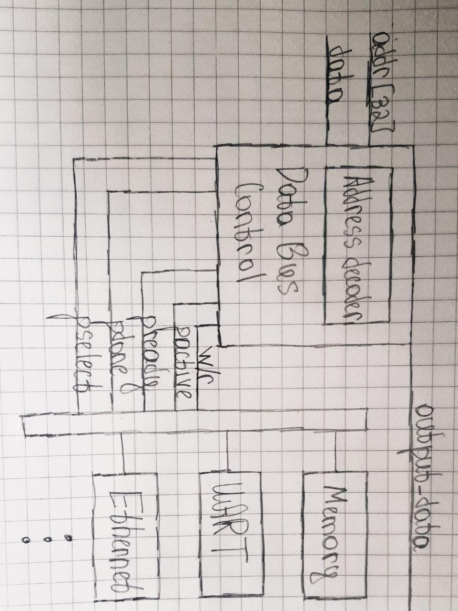

# MIPS
Mips-ish processor with 5 stage pipeline.

* Simple one
* Understand how your asm command will work
* Release Memory Mapped IO for peripherals

### Others modules(not included in main processor)
* MMIO for UART and Ethernet. Something like that:

* Actually you should see how for real buses work(APB for example)
### Other stuff to implement, but not include
* Out of order execution(Tomasulo algorithm).
* ALU with faster adder(carry out propagation)

